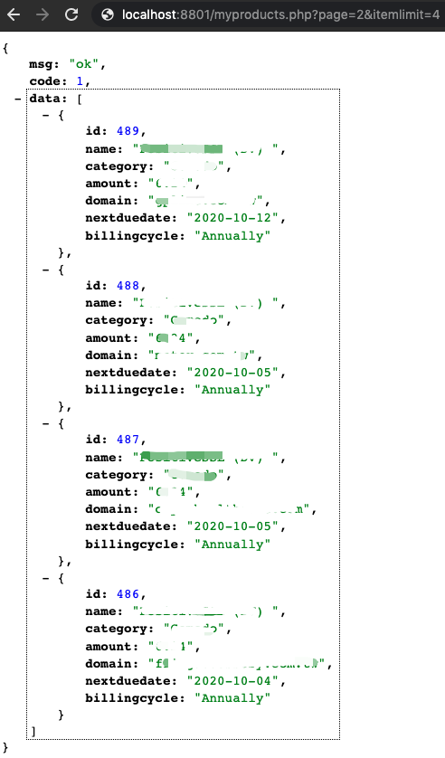

# whmcs-products-interface

## Update

1. 2020-02-06 Create product demo file.
2. 2020-02-07 Suuport page and itemlimit params

## USEAGE

Base on WHMCS 7.x

* Put the myproducts.php in the WHMCS root directory;
* Visit https://yourdomain.com/myproducts.php?page=1&itemlimit=3;
* Get the data as shown in the screenshot;
* Use web front-end framework for development in clientareaproducts.tpl file. Maybe Vue and Angular are great framework;
* Visit https://yourdomain.com/clientarea.php?action=products&page=1;

## IDEAS

1. Create a custom php page in WHMCS; ([Creating Pages](https://developers.whmcs.com/advanced/creating-pages/))
2. Echo json data by Capsule::table();
3. Achieve user experience by requesting this interface asynchronously in clientareaproducts.tpl;

## Screenshot

Looking forward to more demos.

## License

The MIT License (MIT)
